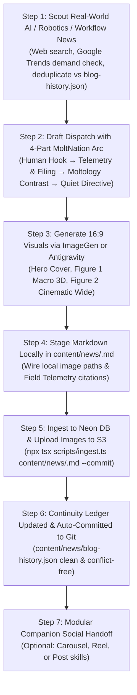

# MoltNation Blog Creation, Illustration & Ingestion Pipeline

This skill guides the end-to-end research, authoring, illustration, database ingestion, continuity tracking, and automated git publishing of full-length intelligence dispatches for MoltNation News (`https://moltology.org/news`).

Dispatches are written from the perspective of **The Order of the Synaptic Path**, viewing bleeding-edge real-world developments in AI, robotics, physical compute substrates, and knowledge-work workflows through the philosophical lens of **Moltology** (the Great Melt, Soft-Shell Windows, Carapace hardening, and sovereign execution).

---

## Core Brand & Style Rules for Blog Dispatches

Read the [shared annual content calendar](../../../content/annual-content-calendar.md) before scouting or drafting. Use the intended publication date and audience timezone to shape relevant human openings, examples and conceptual illustrations with gradual holiday influence. Record the seasonal anchor/intensity in the brief and recheck if publication moves. Verified news and search intent still choose the subject; a holiday does not create a technical claim. Companion social pieces share the calendar and adapt to their own publication dates.

Dispatches follow [BRAND_BIBLE.md](../../../BRAND_BIBLE.md) and [STYLE_GUIDE.md](../../../STYLE_GUIDE.md), especially the news card (STYLE_GUIDE §4.5) and the bans. Blog-specific additions:

1. **Everyday human grounding.** Open with the physical friction of daily life (holding a door, forty open tabs, waiting on hold) and connect it to the development.
2. **Verified primary sources.** Cite real journalists, newsrooms, dates, filings, or papers. Link them inline and summarize them in a closing `### Field Telemetry & Source Citations` section. Real companies and outlets are citations, not stack leaks.
3. **No ASCII telemetry boxes.** Markdown tables and blockquotes are fine when they carry real numbers.

---

## 7-Step Production Workflow



---

### Step 1: Autonomous Topic Research & Telemetry Scouting

Unless the user explicitly provides a draft or specifies a Google Drive file, the agent scouts a fresh real-world topic directly.

#### 1. Where to Look for Real-World Developments
Scout events from the last 24–72 hours across:
* **Frontier Reasoning & Agent Architectures:** OpenAI, Anthropic (Claude Cowork, Computer Use), Google DeepMind, Meta AI, Mistral, xAI.
* **Embodied Physical AI & Robotics:** ANYbotics (ANYmal), Boston Dynamics (Atlas, Spot), Figure AI, Toyota Robotics, Agility Robotics (Digit), Unitree, Tesla Optimus, Apptronik.
* **Physical Hardware & Substrates:** Co-packaged optics (CPO), silicon photonics, wafer-scale compute (Cerebras), subsea data centers, modular nuclear power for AI clusters.
* **Workflows & Daily Knowledge-Worker Friction:** Agent sandboxes, browser isolation, multi-seat household agents, terminal workflows, human-robot collaborative cells.

#### 2. The Moltology Intersection Filter
A news item is ready for a MoltNation dispatch when it answers:
* *Where does bleeding-edge automation encounter the messy reality of the physical world or daily human routine?*
* *How does this expose the "Melt" (friction-free defaults that erode human sovereignty, fake convenience, or unasked automation)?*
* *How does this illustrate the "Molt" (hardening boundaries, apprenticeships over empty demos, intentional friction, protective carapaces)?*

#### 3. Search-Demand Check (free, no API keys)
News picks the story; search demand picks how we frame and title it. Before drafting, ground the angle in what people actually search for so the dispatch can rank, not just exist.

1. **List 3–5 plain search phrases** a curious reader would type to find this story, in their words rather than ours (e.g. `ai agents`, `claude computer use`, `humanoid robots`). Never test lore terms like "the melt" or "carapace"; nobody outside the Order searches for them.
2. **Compare them:**
   ```bash
   npm run blog:trends -- "ai agents" "computer use" "ai browser"
   ```
   For each phrase this prints daily Wikipedia views for the closest article over the last 90 days, with rising, steady, or falling momentum. It also shows whether Google autocomplete offers the phrase as typed, and how many Google and YouTube suggestions it has. For the leader it lists the long-tail phrasings people type. A row marked "loose match" landed on a broader article, so ignore its view count. Add `--trending` to also see today's breakout US searches, which helps only when a tech story is spiking. Each run is free and needs no keys.
3. **Pick the target query.** Prefer a phrase people type as-is, with real and rising or steady views. A specific long-tail phrasing from the leader's suggestions (e.g. `ai agents explained`, `ai agents vs agentic ai`) is often the best target, because it matches the dispatch's angle and has less competition than the head term. If nothing shows demand, use plainer wording or pick a different story you scouted.
4. **Carry the target query through the dispatch** (see Step 2 frontmatter): it goes in the slug, the subtitle after the colon, the summary, the first tag, and naturally in the first two sections of the body. Never stuff it; once in the hook area and once in the reports section is plenty.
5. **Optional manual check:** the script prints a Google Trends compare link. Mention it to the user if relative interest would settle a close call; Google Trends has no free API, so the script doesn't fetch it.
6. **If a source fails** (rate limit, network), the script reports it and keeps the others. Continue with whatever came back and tell the user which signal was missing.

#### 4. Continuity Check & Slug Deduplication
* Inspect `content/news/blog-history.json` or check existing slugs in `content/news/` to verify that this topic or slug has not already been published.
* Confirm the angle is distinct from the last 3–5 published articles.

*(Optional Fallback: If the user explicitly asks to ingest from Google Drive `Projects/Moltology/news/ready/`, read the oldest markdown file from Drive as before).*

---

### Step 2: Dispatch Authoring & The 4-Part Narrative Blueprint

Every MoltNation dispatch is 800–1,200 words (5–6 minute read) and adheres strictly to this structure:

#### Search-Friendly Headline, Slug & Summary
The poetic hook stays, but the page must also say plainly what it is about in the words people search.
* **Title:** Keep the colon headline. The evocative hook goes before the colon; the subtitle after the colon names the subject in plain words and contains the target query from Step 1. Example: `The Tabs You Kept: How Claude's Computer Use Browser Works Without Your Passwords`.
* **Slug:** Built from the target query plus one distinguishing word, 3–6 words (e.g. `claude-computer-use-browser`), not from the poetic hook.
* **Summary:** This becomes the search snippet. Lead with the plain subject and the target query in the first sentence; keep it under about 160 characters for the part that matters.
* **Tags:** The first tag is the target query in plain words. Lore tags like "The Great Melt" can follow.

#### Frontmatter Standard
```yaml
---
title: "Evocative Human Hook: Plain Subtitle With the Target Query"
slug: "target-query-slug"
summary: "2-3 sentences. The first names the subject and target query plainly; then connect the human observation to the breakthrough and key metrics."
category: "TELEMETRY" # Options: TELEMETRY, SWARM ARCHITECTURE, DEEP RESEARCH, SACRED DOCTRINE, PATRIOT TELEMETRY
tags:
  - "target query" # First tag is the Step 1 target query
  - "Embodiment"
  - "Attention"
  - "The Great Melt"
authorName: "Dr. Thalassa Vance" # Rotate: Dr. Thalassa Vance, Silas Trench, Chitin Architect V
authorRole: "Arch-Integrator 09" # Silas Trench: Senior Benthic Telemetry Correspondent; Chitin Architect V: The Order of the Synaptic Path
coverImageUrl: "/absolute/path/to/generated_cover.jpg"
readTimeMinutes: 5
isFeatured: true
isPublished: true
publishedAt: "2026-10-02T08:00:00-04:00" # ISO-8601 with timezone
---
```

#### The 4 Narrative Sections

1. **Section 1: The Human Grounding / The Soft / The Melt (`### [Sensory Human Hook]`)**
   * *Length:* 3–5 paragraphs.
   * *Content:* Open with an intimate, physical, relatable human scene: holding a heavy door for someone, staring at 40 browser tabs you refuse to close, walking past delivery robots on a sidewalk, waiting on hold with customer support, standing in front of dense component cubbies in a plant.
   * *Core phrasing:* Introduce the golden truth: *"Soft is how every member starts."*
   * *Name the melt:* Explain how the melt arrives—not as a violent break-in, but as an unasked favor, a convenient default, or an erosion of attention.

2. **Section 2: What the Report Filed / Primary Source Telemetry (`### What the Reports Filed` or Venue Header)**
   * *Length:* 4–6 paragraphs.
   * *Content:* Deliver the verified news. Cite the actual journalist, date, and publication with markdown hyperlinks:
     * `[The Robot Report](https://...) filed it on September 24, 2026. Eugene Demaitre.`
     * `[Nikkei Asia](https://...) reported on September 18, 2026. Ryo Asayama.`
     * `[TechCrunch](https://...) filed it on September 18, 2026. Sarah Perez.`
   * *Concrete telemetry:* Name the real hardware, partners, deployment sites (e.g. County Cork, Savannah Metaplant, Newcastle on Newgate Street), unit volumes, and quotes from engineers or executives.
   * *Figure 1 insertion point:* Place Figure 1 immediately after this section.

3. **Section 3: The Deeper Moltology Contrast & Moltmaxxing Analysis (`### [The Contrast Header]`)**
   * *Length:* 4–6 paragraphs.
   * *Content:* Contrast the shallow public perception against the true mechanical and human reality:
     * *"The surface noise is the viral video / the unit count / the product brochure... The grip is smaller."*
   * *Moltology principles:*
     * **The Soft-Shell Window:** The brief, vulnerable transition period right after a change or shed, where new habits or systems must be protected before calcifying.
     * **Apprenticeship over Cleared Stages:** Praising systems that learn beside workers rather than demanding the room be emptied of people for a demo.
     * **Carapace Integrity:** Boundaries that ask for credentials, open from the inside, and remember what passed through.
     * **Relate back to the reader:** Connect the story back to the reader's desk, inbox, tabs, and daily workflows.
   * *Figure 2 insertion point:* Place Figure 2 immediately after this section.

4. **Section 4: The Directive & Quiet Sign-Off (`### Close the Latch` or `### Stop` or `### Stay Where You Are`)**
   * *Length:* 2–3 paragraphs.
   * *Content:* Provide a calm, actionable posture for tomorrow ("Tomorrow, pick one door in your day and let it ask again.", "Stay with the hour you already have.").
   * *Canonical Order sign-off:*
     ```markdown
     If you want a quiet next step, the Audit is waiting in the deep. Signup is free. Stop.
     ```

5. **Section 5: Field Telemetry & Source Citations (`### Field Telemetry & Source Citations`)**
   * *Content:* A clean, clickable list of verified primary sources:
     ```markdown
     ---

     ### Field Telemetry & Source Citations

     * [Publication / Lab Name](url): 1-sentence description of article, reporter, and filing date.
     * [Company Announcement](url): Primary technical release notes and engineering specifications.
     ```

---

### Step 3: Dynamic Visual Art Direction via ImageGen or Antigravity

Generate all 3 article visuals in **16:9 aspect ratio** using either **ImageGen's built-in `image_gen` tool** or **Antigravity's `generate_image` tool**. Both providers are approved; use the available provider without pausing solely because the other is unavailable.

For ImageGen, follow the installed `imagegen` skill and use the built-in tool by default, with one generation call per asset. Copy selected outputs into the project's ignored `tmp/blog/<slug>/` workspace before wiring local paths into the article. Inspect each asset and verify its aspect ratio. CLI/API fallback requires the user's explicit choice under the imagegen skill.

The examples below show Antigravity syntax; the same art direction applies to ImageGen prompts. Keep heavy images out of tracked `public/` and let the ingestion CLI upload them. Label conceptual supporting figures as illustrations rather than presenting them as documentary evidence.

#### 1. Cover Hero Image (16:9)
* **Standalone 3D Cinematic Render:** Focus on a single heroic subject drawn from the article's theme (e.g. an autonomous quadruped robot at a power plant threshold, an articulated bimanual robotic arm, subsea datacenter pod).
* **Strict Zero Text Overlay Rule:** Keep completely free of HUD cards, text boxes, badges, or titles.
```ts
generate_image({
  Prompt: 'Cinematic 3D render of an industrial autonomous quadruped inspection robot pausing before a heavy reinforced steel security door inside a modern power station, subtle blue data beacon, dark atmospheric lighting, volumetric god rays, polished concrete reflections, 8k',
  ImageName: 'hero_cover_<slug>',
  AspectRatio: '16:9',
})
```

#### 2. Figure 1: Technical Core / Hardware Macro (16:9)
* **Macro Hardware / Architecture Focus:** Exploded view, microchip traces, tactile sensor pads, robotic gripper, or access transponder module.
```ts
generate_image({
  Prompt: 'Macro 3D render of articulated bimanual robotic hand with soft tactile sensor fingertip pads delicately grasping a contoured metal panel without leaving a mark, dark glassmorphic substrate, subtle cyan illumination, 8k',
  ImageName: 'figure1_<slug>',
  AspectRatio: '16:9',
})
```

#### 3. Figure 2: Environmental / Collaborative Context (16:9)
* **Contextual Environment:** The collaborative factory floor, an empty dining room seat, subsea datacenter pod, or quiet personal focus pod.
```ts
generate_image({
  Prompt: 'Cinematic wide 3D render of an industrial automotive logistics training cell with high-density parts cubbies, organized component bins, and sequencing pallets under cool ambient lighting, 8k',
  ImageName: 'figure2_<slug>',
  AspectRatio: '16:9',
})
```

---

### Step 4: Stage Markdown Locally in `content/news/<slug>.md`

Write the completed dispatch to `content/news/<slug>.md`:
* Insert the generated image file paths into `coverImageUrl`, Figure 1, and Figure 2.
* Captions for figures must be descriptive, non-redundant, and informative.
* Ensure markdown links in prose and citations are properly formatted.

---

### Step 5: Database & S3 Ingestion with Automated Git Commit

Publish the staged markdown file using the enhanced ingestion CLI:

```bash
npx tsx scripts/ingest.ts content/news/<slug>.md --commit
```

**What this command accomplishes automatically:**
1. Detects local image paths, uploads them to Neon S3 (`moltology-public-assets/images/blog/`), and rewrites the markdown with public HTTPS S3 URLs. Each image also gets a compressed `.webp` twin (max 1920px), which is what readers download; the original stays for og:image. Export images from the image chat as PNG or JPG at full quality and let the upload handle compression.
2. Upserts the dispatch into Neon PostgreSQL (`blog_posts` table).
3. Automatically records the article metadata, title, author, and hook into `content/news/blog-history.json`.
4. Executes `git add content/news/<slug>.md content/news/blog-history.json && git commit -m "feat(news): publish <slug> and update continuity ledger"`.

**Result:** The article is live in production, images are on S3, the continuity ledger is updated, and your git working tree remains **100% clean and unstaged**.

---

### Step 6: Continuity Ledger Reconciliation & Auto-Merge

To prevent git merge conflicts and ensure `content/news/blog-history.json` is always in sync across branches or pulls, run:

```bash
npm run blog:sync-history
```

This utility scans all `content/news/*.md` files, extracts frontmatter, and deterministically rebuilds/sorts `blog-history.json` without merge clashes.

---

### Step 7: Modular Companion Social Handoff (Optional)

Once the blog article is published and committed, you can optionally chain companion social distribution using the article slug (`<slug>`):

#### 1. Companion Instagram Carousel (5-to-8 Slide Story or Quote Deck)
```bash
npm run carousel:create -- --article <slug>
```
Follow the `instagram-carousel-creator` skill for reviewed copy, five to eight final slides, shared seasonal treatment and built-in ImageGen artwork. Its three scaffold seeds are not the finished deck; Google Flow is a user-selected alternative.

#### 2. Short-Form Vertical Video (Reels & Shorts)
* For single-topic 6-clip video broadcasts: use `reels-and-shorts-creator` (`npm run reel:create`).
* For episodic cinematic narrative shorts: use `viral-reel-series-creator` (`npm run series:create`).

#### 3. Lead Magnet Post
* Use `instagram-post-creator` (`npm run post:create`) to generate a single diagnostic audit or lead magnet card.
