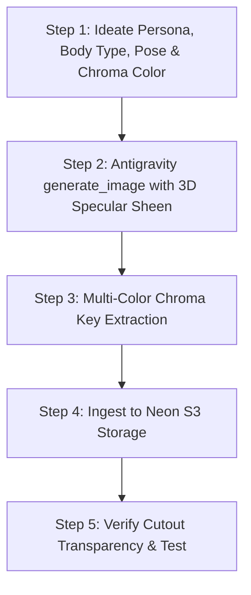

# Moltology Cartoon Character Creator Pipeline

This skill guides the creation, illustration, extraction, and deployment of 3D animated crustacean mascots for Moltology's web platform, news articles, video reels, social posts, and benthic HUD interfaces.

It builds directly upon the **Chroma Key Studio** engine (`scripts/chroma_key.py`) and Antigravity's built-in `generate_image` tool.

---

## ◈ 1. Worldbuilding & Character Family Philosophy

Moltology's characters belong to a living, interconnected, diverse crustacean world and family. They share a consistent high-end **3D Pixar / DreamWorks animated feature CGI aesthetic** (rich volumetric modeling, satin chitin sheen, specular highlights, and subsurface scattering), celebrating wide visual and physical variety across individuals:

### 1. Shared Core 3D CGI Aesthetic Foundation (Non-Negotiable)
* **3D Volumetric Form & Specular Surface Sheen**:
  - High-end 3D CGI character render matching Pixar RenderMan / DreamWorks studio animation standards.
  - **Satin / Semi-Gloss Chitin Sheen**: Smooth carapace with delicate specular highlights that catch studio lights across curved contours, claws, and segmented joints.
  - **Organic Subsurface Scattering (SSS)**: Gentle internal light diffusion beneath the shell and underbelly plates that gives organic life and warmth, avoiding flat plastic or dull 2D chalkiness.
  - **Ray-Traced Ambient Occlusion & Depth**: Deep, soft contact shadows in carapace crevices, joint sockets, and belly seams to define 3D volume.
* **Glassy Reflective Eyes**:
  - Glossy, multi-layered cartoon eyes with distinct specular catchlights, glassy corneal depth, dark pupil contrast, and expressive brow ridges that convey warmth, humor, and intelligence.
* **Articulated Anatomy**:
  - Defined segmented carapaces, articulated ball-and-socket limbs, cute rounded pincers/claws, and segmented tail fans with tactile mechanical/organic presence.
* **STRICT ANTI-FLATNESS RULES**:
  - **NEVER** generate flat 2D vector art, flat cel-shaded drawings, 2D stickers, or chalky/matte claymation figurines.
  - Every character **MUST** have visible 3D lighting, curved specular sheen, and rich depth.

### 2. Physical & Silhouette Diversity (Not Identical Clones)
Characters should feel varied across the cast:
* **Body Types & Silhouettes**:
  - *Thick / Chunky Heavy-Lifters*: Broad, sturdy carapaces, thick muscular legs, robust heavy claws.
  - *Slender / Agile Technicians*: Sleek, streamlined shells, quick delicate claws, agile posture.
  - *Tall & Imposing Leaders*: Elongated carapaces, confident upright stance.
  - *Petite / Round Clingers*: Compact, rounded, adorable proportions with oversized curious eyes.
  - *Smart & Attractive Specialists*: Sleek polished shell contours, refined aesthetic lines, charismatic presence.
* **Color & Shell Tone Variations**:
  - Varying shades of red: vibrant coral-red, deep crimson, terra cotta, burnt orange, bright tangerine, sunset bronze, or deep benthic oceanic navy/teal accents.
  - Soft underbellies: warm tan, creamy sand, peach, or pale buttercup yellow with subtle sheen.
* **Eye Colors**:
  - Warm chocolate brown, bright azure blue, hazel, glowing amber, or emerald green.
* **Apparel, Tech & Personality Props**:
  - Yellow safety hardhats, protective work goggles resting on foreheads.
  - Translucent cyan cybernetic chestplates and glowing HUD visors.
  - Holographic diagnostic tablets, laser wrenches, mini yellow bubble submarine companions.
  - High-tech backpacks, mechanical tool belts, research clipboards, or underwater telemetry gauges.
* **Dynamic, Varied Posing**:
  - Characters should be generated in action-oriented, emotive, and purposeful poses:
    - *Diagnostic / Engineering*: Holding up a holographic tablet, scanning an anomaly, tuning a wrench.
    - *Celebration / Motivation*: Cheering with both claws raised, giving a thumbs-up, leaping in triumph.
    - *Heroic / Confident*: Arms crossed with a knowing smirk, superhero three-point stance, pointing forward decisively.
    - *Benthic Calm / Zen*: Floating weightlessly in hydrostatic peace, meditating, observing caustics.
    - *Playful / Curious*: Peeking over a border, clinging with one claw, scratching head in puzzlement.

### 3. Lighting, Scene Blending, Visibility & Sizing Guidelines
* **Clear Visibility Without Obvious Lighting**: Characters must always be clearly visible with high contrast against the backdrop, but any lighting effect should **not be obvious** (avoid artificial or forced backlights, stark floor beams, or halo outlines).
* **Seamless Scene Integration**: Characters should look naturally blended into their environment with consistent ambient shading and soft contact shadows that ground them organically.
* **Proportional Scaling & Space**: When given enough layout space (such as in outro CTA cards, editorial banners, hero mockups, or social post graphics), characters **can be sized slightly larger than their reference** to ensure strong visual clarity, expressive charm, and engaging presence.

---

## ◈ 2. Discovering Available Characters in S3

Characters are hosted on **Neon S3** (`moltology-public-assets/images/characters/`).

To discover existing character cutouts, inspect the `images/characters/` folder on S3, check `scratch/character_refs/`, or look at [`scripts/lib/character-overlay.ts`](file:///Users/mylesstupp/Development/moltology/scripts/lib/character-overlay.ts).

All character files adhere to the naming convention: `char_<name>.png` (e.g. `char_lobster_pointing_cta.png`, `char_lobster_thumbs_up.png`, `char_lobster_engineer.png`, `char_crab_pointing_stats.png`).

---

## ◈ 3. 5-Step Creation & Deployment Workflow



---

### Step 1: Ideate Persona, Physical Traits, Pose & Chroma Color

1. Choose a distinct role, personality, body build, apparel, and pose for the character.
2. Select the optimal high-contrast chroma key background color:
   - **Hot Pink / Magenta (`#FF00FF`)**: Recommended default for red, orange, yellow, cyan, teal, navy, green, and bronze characters.
   - **Chroma Green (`#00FF00`)**: Best for characters featuring pink, purple, dark red, or solid blue where green is strictly absent.

---

### Step 2: Generate via Antigravity `generate_image`

Always enforce **3D CGI Pixar/DreamWorks rendering, specular shell sheen, subsurface scattering, and glossy eye reflections**.

Optionally pass `ImagePaths` with existing character references (e.g. `scratch/character_refs/char_lobster_speed_action.png` or `scratch/character_refs/char_lobster_pointing_cta.png`) to anchor visual style and material sheen continuity.

Invoke `generate_image` using the standardized character prompt blueprint:

```json
{
  "Prompt": "3D Pixar and DreamWorks animated feature film CGI style, high-end 3D character render, cute charming cartoon [COLOR_TONE_E.G._CORAL_RED] lobster mascot matching the Moltology character family, [BODY_TYPE_E.G._THICK_AND_STURDY_OR_SLEEK_AND_AGILE], [APPAREL_AND_PROPS_E.G._YELLOW_SAFETY_HARDHAT_AND_HOLOGRAPHIC_TABLET], [DYNAMIC_POSE_AND_EXPRESSION_E.G._CHEERFUL_WIDE_TOOTHY_GRIN_WAVING], [EYE_COLOR_AND_FEATURES_E.G._BIG_GLOSSY_EXPRESSIVE_BROWN_EYES_WITH_SHINY_SPECULAR_CATCHLIGHTS], smooth chitin shell with subtle satin sheen and soft specular lighting highlights along curved carapace contours, warm tan underbelly plates with subsurface scattering, volumetric 3D modeling with ray-traced ambient occlusion, articulated claws and legs, isolated on a completely uniform seamless flat solid vivid hot pink background (hex #FF00FF), perfectly plain solid flat hot pink, no gradients, no textures, no floor, no shadows on the background, clean sharp silhouette, the character does not contain any pink color, no 2D flat illustration, no flat vector art, no cel-shading, high-resolution full body 3D character render",
  "ImageName": "char_[name]_chroma",
  "AspectRatio": "1:1",
  "ImagePaths": ["scratch/character_refs/char_lobster_speed_action.png"]
}
```

---

### Step 3: Run High-Precision Chroma Key Extraction

Execute `scripts/chroma_key.py` with auto-detection, Hollywood Keylight de-mixing, edge-weighted despill, and auto-trimming:

```bash
python3 scripts/chroma_key.py \
  <path_to_generated_image.jpg> \
  scratch/characters/char_<name>.png \
  --color auto \
  --tolerance 48 \
  --smoothness 28 \
  --despill-strength 0.85 \
  --trim \
  --margin 24
```

---

### Step 4: Ingest to Neon S3 Storage

Upload the extracted PNG cutout to the Neon S3 public assets bucket (`moltology-public-assets`):

```bash
npx tsx scripts/upload-asset.ts \
  scratch/characters/char_<name>.png \
  --key images/characters/char_<name>.png
```

Verify the uploaded public CDN URL:
`https://br-bitter-dew-ayea5tmh.storage.c-5.us-east-2.aws.neon.tech/moltology-public-assets/images/characters/char_<name>.png`

---

### Step 5: Dynamic Usage & Compositing

Any character uploaded to S3 can be loaded immediately and stamped onto images using `overlayCharacterOnImage` from [`scripts/lib/character-overlay.ts`](file:///Users/mylesstupp/Development/moltology/scripts/lib/character-overlay.ts):

```typescript
import { overlayCharacterOnImage } from '../../scripts/lib/character-overlay'

// Resolves directly from local scratch/character_refs or S3 dynamically!
await overlayCharacterOnImage(baseImagePath, outputImagePath, {
  character: 'lobster_engineer', // or 'char_lobster_engineer.png'
  position: 'bottom-right',
  scalePercent: 30,
})
```
