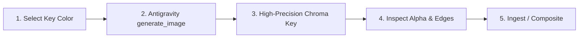

# Chroma Key Studio & Character Extraction Pipeline

This skill automates the complete lifecycle of generating and extracting transparent PNG cutouts, cartoon mascots, UI elements, and merchandise illustrations using **Antigravity's built-in `generate_image` tool** combined with the **high-precision multi-color chroma key engine** (`scripts/chroma_key.py`).

---

## ◈ The Chroma Key Strategy

When generating isolated subjects or mascots, the goal is to produce an image on a high-contrast, perfectly flat background of a single solid color that **does not exist anywhere on the subject**.

### 1. Key Color Selection Matrix

Choose the background chroma key color based on the subject's palette:

| Key Color | Hex / Preset | When to Use (Best Subject Palette) | When to Avoid |
| :--- | :--- | :--- | :--- |
| **Hot Pink / Magenta** | `#FF00FF` (`pink` / `magenta`) | Cyan, teal, deep navy, dark chitin, orange, red, yellow, bronze, gold, green subjects. *Ideal for Moltology cybernetic crustaceans.* | Subjects with pink accents, glowing magenta lights, or fleshy tones. |
| **Chroma / Lime Green** | `#00FF00` (`green` / `lime`) | Red, orange, blue, navy, gold, purple, white, grey subjects. | Subjects with green algae, green LED accents, or green eyes. |
| **Chroma Blue** | `#0000FF` (`blue`) | Warm subjects (bright red, orange, yellow, amber, white) with zero blue. | Benthic cyan / teal / navy crustacean armor. |
| **Pure Cyan** | `#00FFFF` (`cyan`) | Warm red, orange, amber, golden-yellow, black subjects. | Benthic cyber-lobster HUD elements (which use cyan). |
| **Pure White** | `#FFFFFF` (`white`) | Dark / saturated subjects with strong black silhouettes. | Light-colored or semi-transparent subjects. |

---

## 2. 5-Step Production Workflow



---

### Step 1: Prompt Engineering for Solid Chroma Backgrounds

Always invoke the built-in Antigravity `generate_image` tool with strict background isolation constraints:

#### Prompt Blueprint:
```text
3D Pixar and Overwatch style, cute charismatic cybernetic cartoon [SUBJECT], [ACTION_OR_POSE], [EXPRESSION_AND_DETAILS], [MATERIAL_PROPERTIES_E.G._CHITIN_METALLIC_GOLD_CYAN_LEDS], isolated on a completely uniform seamless flat solid vivid [COLOR_NAME] background (hex #[HEX_CODE]), perfectly plain solid flat [COLOR_NAME], no gradients, no textures, no floor, no shadows on the background, clean sharp vector-like outline, the subject does not contain any [COLOR_NAME] color, high-resolution full body render.
```

#### Key Prompt Constraints:
* **Explicit Background Isolation**: State `"isolated on a completely uniform seamless flat solid vivid [COLOR] background"` and `"perfectly plain solid flat [COLOR]"`.
* **Zero Shadow / Gradient Constraint**: State `"no gradients, no textures, no floor, no shadows on the background"`.
* **Negative Color Exclusion**: Explicitly declare `"the subject does not contain any [COLOR] color"`.
* **Tool Call Parameters**:
  - `AspectRatio`: `'1:1'` (mascots/stickers), `'3:4'` (standing characters), or `'16:9'` (wide scene elements).
  - `ImageName`: Descriptive lowercase name (e.g. `mantis_punch_chroma`).

---

### Step 2: Invoke Antigravity `generate_image`

Call `generate_image` directly:
```json
{
  "Prompt": "3D Pixar and DreamWorks animated feature film style, cute charming cartoon coral-red lobster mascot, wearing a cute yellow safety hardhat with small goggles, holding up a glowing cyan holographic diagnostic tablet screen in one claw, waving cheerfully with the other claw, warm toothy smile, big expressive friendly brown eyes, soft velvety matte red chitin shell texture with pale tan segmented belly plates, articulated claws and legs, isolated on a completely uniform seamless flat solid vivid hot pink background (hex #FF00FF), perfectly plain solid flat hot pink, no gradients, no textures, no floor, no shadows on the background, clean sharp silhouette, the character does not contain any pink color, high-resolution full body 3D character render",
  "ImageName": "lobster_engineer_chroma",
  "AspectRatio": "1:1"
}
```

---

### Step 3: Run the Multi-Color Chroma Key Engine

Execute `scripts/chroma_key.py` on the generated image:

```bash
# Auto-detect background color (recommended):
python3 scripts/chroma_key.py <input_image_path> <output_png_path> --auto --trim --margin 24

# Or specify exact key color and tune thresholds:
python3 scripts/chroma_key.py <input_image_path> <output_png_path> \
  --color pink \
  --tolerance 60 \
  --smoothness 30 \
  --despill-strength 0.85 \
  --trim \
  --margin 24
```

#### CLI Parameters:
* `-c, --color`: Color preset (`pink`, `magenta`, `green`, `blue`, `cyan`, `yellow`, `white`, `black`), hex (`#FF00FF`), or `auto` (default: `auto`).
* `-t, --tolerance`: Inner distance threshold for 100% transparency (default: `60.0`).
* `-s, --smoothness`: Outer smooth transition width for soft anti-aliased alpha ramp (default: `30.0`).
* `--despill-strength`: Color fringe suppression strength from `0.0` to `1.0` (default: `0.85`).
* `--trim`: Automatically crops transparent margins to the subject's tight bounding box.
* `--margin`: Extra padding in pixels when trimming (default: `20`).
* `--no-flood-fill`: Disables hole protection (by default, internal holes matching the key color are protected).

---

### Step 4: Quality & Alpha Verification

Verify the transparent PNG:
1. **Alpha Channel**: Confirm that background pixels have `alpha = 0` and subject pixels have `alpha = 255`.
2. **Edge Smoothness**: Check that edges are anti-aliased with no jagged pixelation.
3. **Despill Check**: Ensure there is no colored halo/glow around the perimeter of the subject.
4. **Hole Protection**: Verify that white/gray highlights inside the subject remain opaque.

---

### Step 5: Registry & Asset Pipeline Integration (Optional)

If the character is added to the permanent Moltology mascot roster:
1. Upload transparent PNG to Neon S3 (`moltology-public-assets/images/characters/<filename>.png`):
   ```bash
   npx tsx scripts/upload-asset.ts <output_png_path> --key images/characters/<filename>.png
   ```
2. Register in `scripts/lib/character-overlay.ts` under `CHARACTER_REGISTRY`.
3. Update `scripts/lib/character-overlay.test.ts` and run `npx vitest run scripts/lib/character-overlay.test.ts`.
